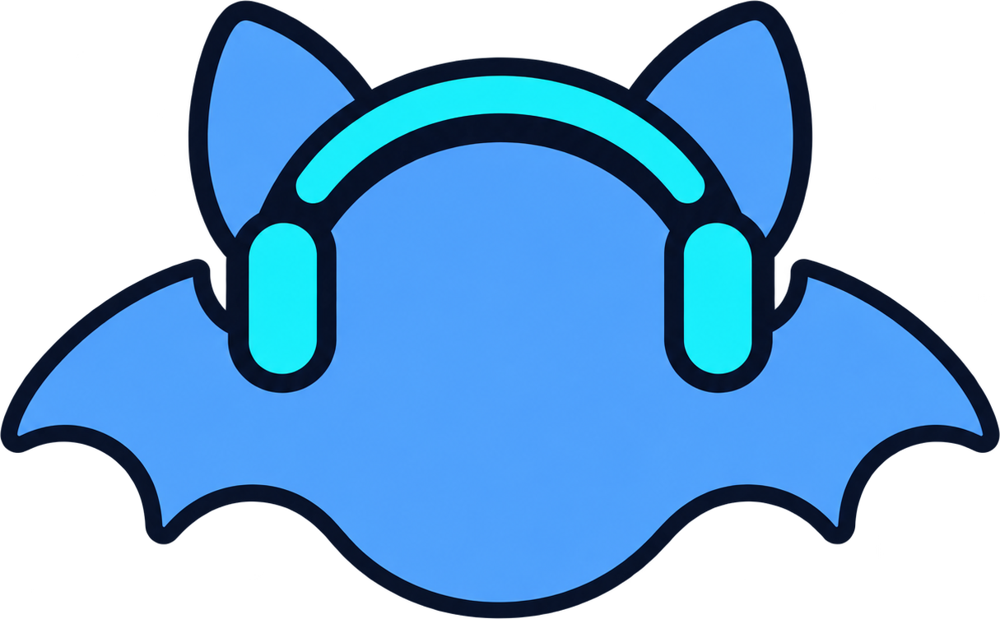
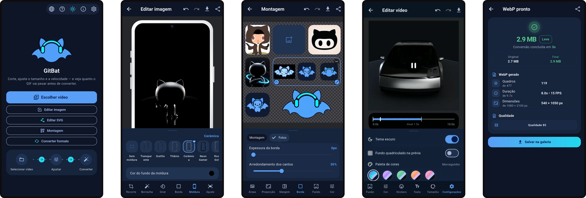

<div align="center">



# GitBat


<p align="center"><a href="https://github.com/lianeheidemann/gitbat-app/actions/workflows/ci.yml"></a>&nbsp;<a href="https://github.com/lianeheidemann/gitbat-app/actions/workflows/release.yml"></a></p>

**Create GIF, WebP and SVG content for your GitHub README<br>
directly on Android — animated, transparent, high-resolution and offline.**


<picture>
  <source media="(prefers-color-scheme: dark)" srcset="assets/interface-v2/gitbat-interface-escuro-v3.webp">
  <source media="(prefers-color-scheme: light)" srcset="assets/interface-v2/gitbat-interface-claro-v3.webp">
  
</picture><br><br>

**[Download the latest APK](https://github.com/lianeheidemann/gitbat-app/releases/latest)**

</div>

## Overview

GitBat started as a simple app to convert videos into GIFs. It kept gaining
features and grew into an app for **creating content for GitHub READMEs**:
banners, demos, badges, collages and illustrations in **GIF, animated WebP, SVG and PNG**.

- **Transparency everywhere** — every editing screen supports a transparent
  background, so the result sits cleanly on GitHub's light and dark themes.
- **Animated or still** — videos, GIFs and animated WebPs stay animated
  through frames, collages, stickers and text.
- **High resolution** — exports keep the original resolution by default;
  shrinking is always your choice.

It's an Android app built with Flutter. Everything runs on the device with
FFmpeg — the app has **no internet permission**.

| Tool | Purpose |
|---|---|
| **Video → GIF / WebP** | Converts MP4, MOV, AVI, MKV, WebM and 3GP into GIF or animated WebP, and **estimates the GIF size before converting**. |
| **Edit image** | Frames a single photo (border or phone mockup), adjusts color and removes objects with a **magic eraser**. |
| **Edit SVG** | Crops, rotates, recolors and decorates an SVG, and saves it **as a vector**. |
| **Photo collage** | Combines photos into one composition — grids, custom layouts, stickers and text. Exports animated when any photo is animated. |
| **Convert format** | Re-encodes a video, GIF or animated WebP to GIF, WebP or MP4. |

| Output | Best for |
|---|---|
| **GIF** | Maximum compatibility; includes size estimation and destination limits. |
| **Animated WebP** | Better color, real transparency and smaller files; has its own quality slider. |

## Features

### Video → GIF / WebP

- Timeline preview, trim and crop (presets or free)
- Rotate in 90° steps and mirror
- Speed 0.25×–4×, resolution as % of the original, 5–24 fps, loop or play once
- GIF: up to 256 colors, five dithering levels, three palette strategies
- **Size estimate** with a confidence range, destination checks and a
  **Measure** button that calibrates on two short real conversions —
  methodology in [`docs/en/HOW_THE_ESTIMATE_WORKS.md`](docs/en/HOW_THE_ESTIMATE_WORKS.md)

### Edit image

- **Borda** (procedural border) and **Moldura** (bundled or imported phone
  mockups, with automatic window detection)
- Content fit — auto, fill, or zoom with a background color
- **Magic eraser** — brush, lasso or rectangle; the background is rebuilt by
  PatchMatch inpainting written in plain Dart (no model, no APK growth)
- Transparent or solid background, color adjustment, stickers and text

### Edit SVG

- Crop, rotate, mirror, background, filter, color, opacity and **border**
- Stickers and text saved as real `<text>` / nested `<svg>` elements
- Tolerant loading: gzip (`.svgz`), UTF-16 and SVGs without a declared size

### Photo collage

- **Layouts** — row, column, fixed grids, free grid up to 6×6, and
  **Personalizada**: a "+" on each side of an area splits it, for montages
  that are not regular grids (up to 16 areas)
- **Áreas** — drag the handles between photos or set width/height in %;
  **Travar área** keeps an area's size fixed and slides it along when a
  neighbor is resized
- Aspect ratio (presets or free), margins, border and corner rounding for
  the montage and for the photos
- Background — transparent, color or image, for the montage and per photo
- Per-photo replace, crop, rotate, flip, recenter and color adjustment
- Stickers (bundled or imported, in folders) and text with imported fonts
- Animated export (GIF or WebP) when any photo is animated, with frames
  decoded only at the size each area needs

### Convert format

- Video, GIF or animated WebP → GIF, WebP or MP4, with a resolution slider
- Animated WebPs open instantly; conversion shows progress from the start
  and can be cancelled at any time

### Common to all editors

- One editor shell: bottom tabs, a collapsible panel, undo/redo, save and share
- **Tap to select** the picture: resize and rotate handles, with snapping
  to the center (pink guide), to 100% and to right angles
- Crop with a window-size slider, **Centralizar** and **Ajustar** (trims
  transparent margins)
- Shared color adjustment — brightness, exposure, contrast, highlights,
  shadows, saturation, hue and temperature — identical in preview and export
- **Configurações** tab with dark theme, preview checkerboard and **color
  palettes** — the official *Morceguinho* (the GitBat bat's blues and cyan)
  plus Lavanda, Menta, Pêssego and Rosa, each in light and dark; the chosen
  one is remembered and also sets the default background, border and text
  colors of the editors
- Confirmation pop-up on every save to the gallery; everything is saved to
  the **GitBat** album and named `GitBat_YYYYMMDD_HHMMSS`

## Download

Each [Release](https://github.com/lianeheidemann/gitbat-app/releases)
ships ready-to-install APKs:

| File | Use |
|---|---|
| `arm64-v8a` | Recommended — virtually every current Android phone |
| `armeabi-v7a` | Older 32-bit devices |
| `universal` | Any device (larger download) |

Pre-releases named `teste-N` are test builds, not stable versions.

## Development

**Requirements:** Flutter 3.47.0 (Dart 3.12+), Android SDK (API 36) and NDK.

```bash
git clone https://github.com/lianeheidemann/gitbat-app.git
cd gitbat-app
flutter pub get
flutter test
flutter run
```

Release build:

```bash
flutter build apk --release --split-per-abi
```

CI pins Flutter to **3.47.0** (`FLUTTER_VERSION` in the workflows). Run
`dart format` on that version if formatting differs locally.

### Continuous integration

| Workflow | Trigger | Result |
|---|---|---|
| `ci.yml` | Every push and PR | Asset-list check, formatting, analysis, tests and a debug APK |
| `release.yml` | Manual or version tag | Tests, then arm64, armeabi-v7a and universal APKs (plus the AAB when signing keys are set) in a new Release |
| `apk-testes.yml` | Manual, any branch | A single arm64 APK in ~3 min, published as a `teste-N` pre-release; the run summary links the APK |

The build workflows keep a Gradle cache between runs, and test builds are
signed with the release key and version code, so they install over the
published version.

### Project structure

```
lib/
├── main.dart
├── app/          # theme, color palettes, licenses, app-wide controllers
├── core/         # shared code: ffmpeg, models, painting, services, ui
└── features/     # one folder per tool
    ├── collage/  ├── home/  ├── photo/
    ├── quick_convert/  ├── svg/  └── video/
test/             # unit, widget and golden-pixel tests
tool/             # icon generation, accuracy script, asset-list sync
recursos/         # stable copies of brand art used inside the app
assets/           # backgrounds, fonts, frames, stickers; plus icon/,
                  # readme/ and interface-v2/ (brand art, not in the APK)
docs/             # en and pt-Br documentation
```

The layout is **feature-first**: code owned by one tool stays in
`features/<tool>`, and only reusable code lives in `core`. Preview and
export share the same painters and FFmpeg argument builders, so what is
shown is what gets saved.

### Adding bundled art

Drop files into `assets/fonts`, `assets/frame` or `assets/sticker` and
build — they are discovered at startup. A **new sub-folder** also needs:

```bash
python3 tool/sincronizar_assets.py
```

CI checks this on every push.

## Quality

- **610+ automated tests** — size model, FFmpeg arguments, crop and frame
  geometry, collage layout and compositing (golden pixels), animation
  timeline, SVG export and editor interactions
- `tool/medir_precisao.py` measures the size model against real FFmpeg
  output; once calibrated it lands within ±1% on three of five reference
  videos

## Stack

| Layer | Choice |
|---|---|
| UI | Flutter (Material 3) |
| Conversion | `ffmpeg_kit_flutter_new_video` — [FFmpeg](https://github.com/FFmpeg/FFmpeg), LGPL build with libwebp |
| Rendering | `dart:ui` — one painter for preview and export |
| Vector art | `flutter_svg`, `xml` |
| Files and output | `file_picker`, `gal`, `share_plus` |
| Magic eraser | Plain Dart PatchMatch in an `Isolate` |

## Brand

| Item | Where |
|---|---|
| App icon (master) | `assets/icon/icon-v2/morceguinho-icone-simples.png` — regenerate every size with `python3 tool/gerar_icones.py` |
| README logo | `assets/readme/gitbat-logo.png` |
| Tech badges | `assets/badge/gitbat-badges-adaptive-v10.svg` |
| Home screen logo | `recursos/marca/gitbat-logo.png` — a stable copy of the README logo |
| Official palette | *Morceguinho* in `lib/app/app_palette.dart` |
| Previous identity | `assets/icon/icon-v1/` |

## License

App code: proprietary — all rights reserved ([LICENSE](LICENSE)).
FFmpeg: LGPL-2.1-or-later — attribution in [`NOTICE`](NOTICE), details in
[`docs/en/LICENSES.md`](docs/en/LICENSES.md).

---

<p align="center">Developed by <strong>Liane Heidemann</strong></p>

<picture>
  <source media="(prefers-color-scheme: dark)" srcset="assets/readme/gitbat-interface-claro-v3.png">
  <source media="(prefers-color-scheme: light)" srcset="assets/readme/gitbat-interface-escuro-v3.png">
  
</picture>
